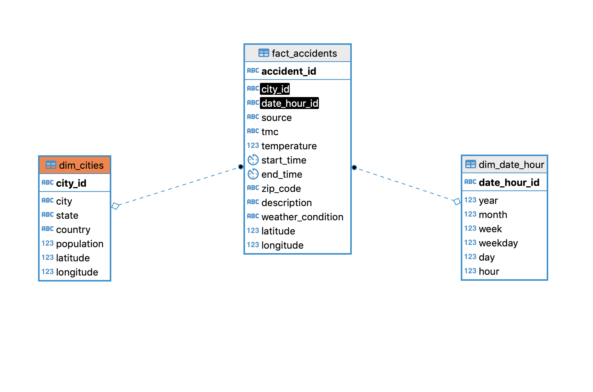

## Data Model

The data model defined for this exercise is described below:

The model was divided in dimension and fact tables:

## the steps necessary to pipeline the data into the chosen data model    

1. Data exploration of all datasets with Jupyter notebooks
2. Uploaded processed datasets to S3 using a python script
3. Create a Redshift cluster by code by code
4. Use Apache Airflow to defined a pipeline to move data from S3 to Redshift

A. Create tables into Redshift
B. Load data in staging tables
C. Load data in fact and dim tables using staging tables
