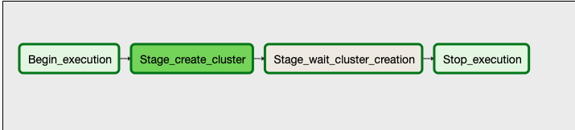
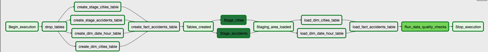

## Data dictionary


### Dimension tables

1. `dim_cities`: Contains information about the cities, their population and location.
        `city_id`: The name of the city concat the state's code.
        `state`: A code two-letters of the state.
        `country`: The code of the country(2 letters).
        `population`: Estimation of the population for the given city.
        `latitude`: The latitude(location) of city
        `longitude`: The longitude(location) of city.
2. `dim_date_hour`: Contains information related to the date and hour  of a accident occurs.
        `date_hour_id`: The date plus a hour, In format 'yyyy-mm-dd HH'
        `year`: The year of the date
        `month`: The month of the date (1 and 12).
        `day`: The number of the day of the month.
        `week`: The number of week of the year.
        `hour`: The hour of day the accidents occurred.


### Fact table

`fact_accidents`:
    - `accident_id`: A identifier for the table provided by dataset.
    - `city_id`: A reference for relation `dim_cities` represent a city
    - `date_hour_id`:  A reference for relation `dim_date_hour` represent a date and an hour
    - `source`: Indicates source of the accident report (i.e. the API which reported the accident.)
    - `TMC`: A traffic accident may have a Traffic Message Channel (TMC) code which provides more detailed description of the event.
    - `temperature`: Shows the temperature (in Fahrenheit).
    - `start_time`: Shows start time of the accident in local time zone.
    - `end_time`: Shows end time of the accident in local time zone. End time here refers to when the impact of accident on traffic flow was dismissed.
    - `zipcode`: Shows the zipcode in address field.
    - `description`: Shows natural language description of the accident.
    - `weather_condition`: Shows the weather condition (rain, snow, thunderstorm, fog, etc.)
    - `latitude`: Shows latitude in GPS coordinate of the start point.
    - `longitude`: Shows longitude in GPS coordinate of the start point.
    
    


## Airflow Configuration
It is a tool that requires a configuration that can be tedious, to facilitate this a docker-compose was prepared to facilitate the task of putting it into operation

To star Airflow:
```bash
docker-compose up
```

## Airflow Pipeline

The pipeline is composed by the following tasks


### Dag create cluster


The unique task in this dag is in chage to create a Redshift cluster to use, this dag must be run only once

### Dag Load_accidents_data_task



This Dag follow the next steps:

1. Delete the stage, dimention and facts tables if exists
2. Create the stage, dimention and facts tables
3. Load the stage(staging area) tables from S3
4. Move data from staging area to fact and dim tables
5. Ensure the quality of the result data by a quality check task


