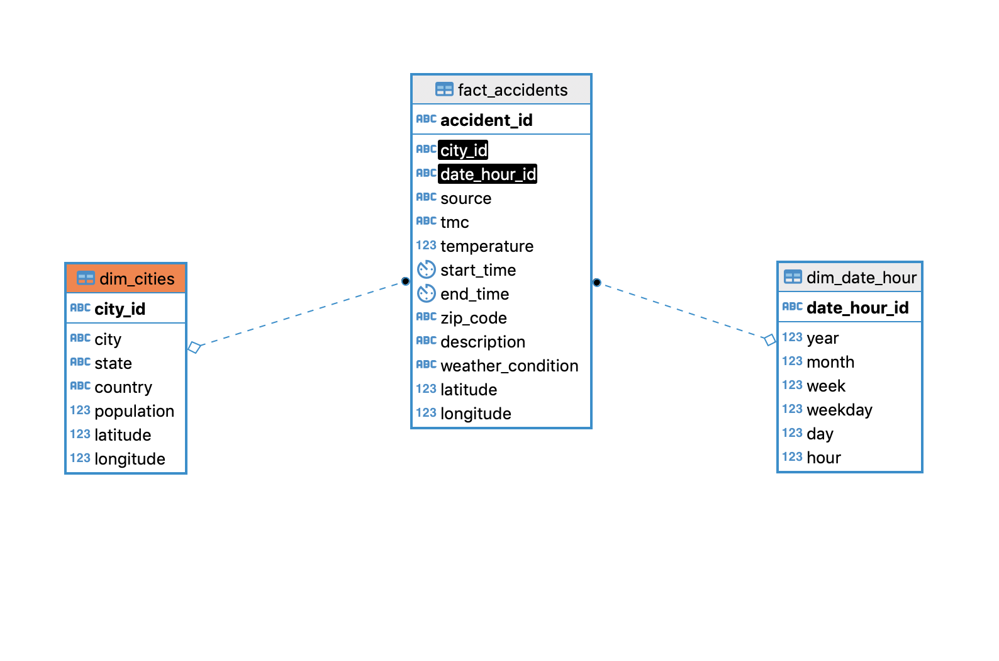
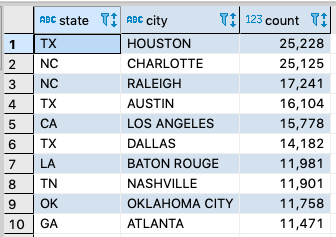
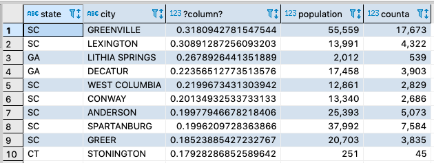
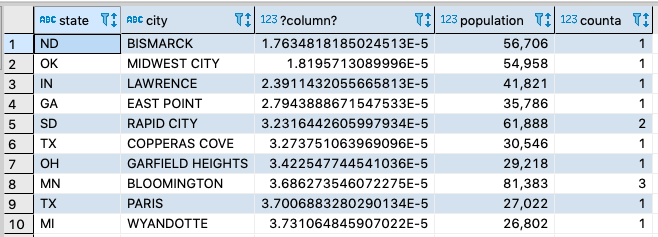

# Udacity's Capstone Project

This project builds a pipeline using Apache Airflow based on public datasets with Amazon redshift as main database.
These dataset will be used to obtain knowledge about the dynamics of accidents in the United States, where they occur, how often and under what conditions, these data could be used by people in charge of making decisions about mobility and projection of road construction, we hope it will also be used by bigdata enthusiasts.

## Datasets
The datasets were taken from www.kaggle.com

- [US accidents](https://smoosavi.org/datasets/us_accidents)  
- [World cities](https://www.kaggle.com/okfn/world-cities)

One of the requirements of this project was to handle at least two sources and more than 1 million rows,
 dataset [US accidents](https://smoosavi.org/datasets/us_accidents) has more than 3 million records

## Main technologies used:

### Apache Airflow to build the pipeline
Apache Airflow is a great tool to create and maintain data-pipelines, It is easy to use and support

### Jupyter Notebook to explore datasets
Jupiter Notebook is a good tool to execute python commands step-by-step, It is useful to interact with data using python

### Amazon S3 to load the pre-processed data
It is the backbone of AWS, it is a virtually unlimited storage service, ease to scale and good integration with Amazon Redshift

### Amazon Redshift as data-warehouse
It is a database that supports terabytes of data, with horizontal scaling and excellent for bigdata

## The steps of the process are:

1. Data exploration and pre-processing of  datasets with Jupyter notebook, looking for missing data or particular cases
2. Transformed datasets are uploaded to S3 using python
3. A Redshift cluster is create by code
4. A pipeline is built on Apache Airflow to load data from Amazon S3 to Redshift into staging tables
5. Some queries are executed in redshift

## How run the program?

1. Download datasets from [US accidents](https://smoosavi.org/datasets/us_accidents) and [World cities](https://www.kaggle.com/okfn/world-cities)
2. Prepare datasets with the [python script]("https://github.com/mrdavidhidalgo/udacity-data-engineering-capstone/blob/master/1%20Explore%20and%20Assess%20the%20Data/prepared_datasets.py)
3. Copy datasets to S3 using [script](https://github.com/mrdavidhidalgo/udacity-data-engineering-capstone/blob/master/2%20Define%20the%20Data%20Model/load_s3.py)
4. Run Airflow using [Docker compose file](https://github.com/mrdavidhidalgo/udacity-data-engineering-capstone/blob/master/3%20Run%20ETL%20to%20Model%20the%20Data/docker-compose.yml)
```
docker-compose up
``
## Data Model

The data model defined for this exercise is described below:



The data model helps us to address the purpose of the project, to the extent that we can relate the accidents with the cities where they occurred and analyze particularities of the city such as the number of inhabitants and accidents such as weather conditions and others.

## Data dictionary

### Dimension tables

1. `dim_cities`: Contains information about the cities, their population and location.
   * `city_id`: The name of the city concat the state's code.
   * `state`: A code two-letters of the state.
   * `country`: The code of the country(2 letters).
   * `population`: Estimation of the population for the given city.
   * `latitude`: The latitude(location) of city
   * `longitude`: The longitude(location) of city.
2. `dim_date_hour`: Contains information related to the date and hour  of a accident occurs.
   * `date_hour_id`: The date plus a hour, In format 'yyyy-mm-dd HH'
   * `year`: The year of the date
   * `month`: The month of the date (1 and 12).
   * `day`: The number of the day of the month.
   * `week`: The number of week of the year.
   * `hour`: The hour of day the accidents occurred.

### Fact table

* `fact_accidents`:
  * `accident_id`: A identifier for the table provided by dataset.
  * `city_id`: A reference for relation `dim_cities` represent a city
  * `date_hour_id`:  A reference for relation `dim_date_hour` represent a date and an hour
  * `source`: Indicates source of the accident report (i.e. the API which reported the accident.)
  * `TMC`: A traffic accident may have a Traffic Message Channel (TMC) code which provides more detailed description of the event.
  * `temperature`: Shows the temperature (in Fahrenheit).
  * `start_time`: Shows start time of the accident in local time zone.
  * `end_time`: Shows end time of the accident in local time zone. End time here refers to when the impact of accident on traffic flow was dismissed.
  * `zipcode`: Shows the postal code in address field.
  * `description`: Shows natural language description of the accident.
  * `weather_condition`: Shows the weather condition (rain, snow, thunderstorm, fog, etc.)
  * `latitude`: Shows latitude in GPS coordinate of the start point.
  * `longitude`: Shows longitude in GPS coordinate of the start point.


## How often the data should be updated?
The data must be updated every month, this because the accident records are totaled every month, another viable option would be annually, it should be remembered that these data must be consolidated before being processed, so the periodicity cannot be less

## Particular Scenarios

### Data was increased by 100x

If the data increased by 100x, we must consider some issues: Storage or partitioning of data

#### Storage
The storage is always a difficult topic, but Amazon S3 still being a good option and Amazon Redshift scale horizontally, another good option is Apache Spark or Snowflake

#### The partitioning of data
Using large files is not a good idea, S3 supports files divided into many parts and is easy to use with Redshift, another option is to partition by data, such as record date.

## Pipelines were run on a daily basis by 7am
In this moment the pipeline take around 5 minutes to load, in the worst case it is always possible to partition the data to process in parallel, this thanks to the capabilities of Redshift.

## The database needed to be accessed by 100+ people.

The main problem of increasing users in the database is the way Redshift operates, the easiest way to meet this need is copies of the Redshift cluster to make queries.


## Result queries

some data analysis queries are listed below:

### Top ten of cities with highest number of accidents in 2018:

```
SELECT c.state,c.city,count(1) FROM fact_accidents  a
JOIN  dim_date_hour d USING (date_hour_id)
JOIN dim_cities c  USING (city_id)
WHERE d.year=2018
GROUP by 1,2
ORDER by 3 desc
LIMIT 10
```
  

### Top ten of cities with the highest number of accidents per inhabitant

```
SELECT state, city, countA::float/population::float, population, countA FROM (
SELECT c.state, c.city, c.population ,count(1) as countA
FROM fact_accidents a JOIN dim_cities c using (city_id)
WHERE c.population is not null
GROUP BY 1,2,3 ORDER BY 4 desc)as a
ORDER BY 3 desc
LIMIT 10
```



### Top ten of cities with the lowest number of accidents per inhabitant
```
SELECT state, city, countA::float/population::float, population, countA FROM (
SELECT c.state, c.city, c.population, count(1) as countA
FROM fact_accidents a JOIN dim_cities c USING (city_id)
WHERE c.population IS NOT NULL
GROUP by 1,2,3 ORDER BY 4 DESC)as a
ORDER BY 3 ASC
LIMIT 10  
```

